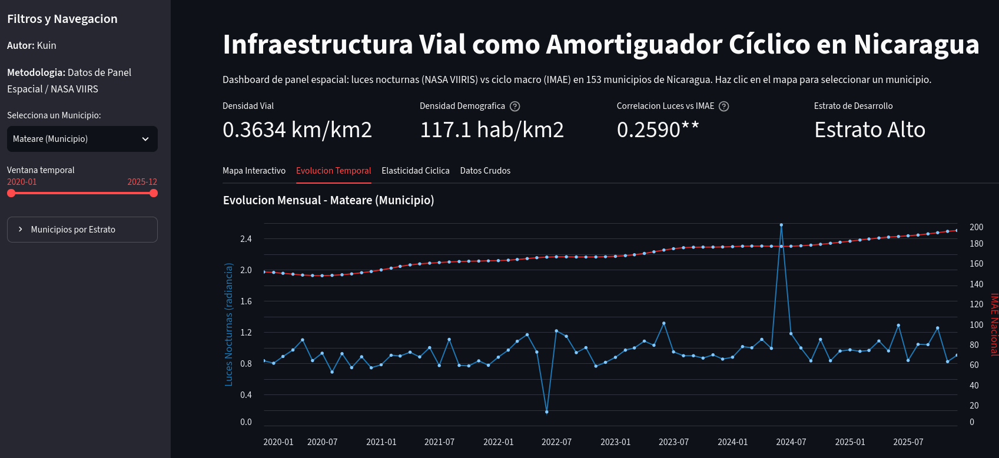

# Infraestructura Vial como Amortiguador Cíclico

[](https://resiliencia-vial-nicaragua.streamlit.app/)

**Evidencia municipal para Nicaragua a partir de imágenes satelitales (2020–2025)**

---

### Dashboard Interactivo

Explore los resultados del panel espacial, la elasticidad cíclica municipal y la clasificación por estratos de desarrollo a través de una aplicación interactiva desplegada en Streamlit Cloud:

[https://resiliencia-vial-nicaragua.streamlit.app/](https://resiliencia-vial-nicaragua.streamlit.app/)

---

## Resumen

El estudio estima cómo la densidad de la red vial modula la transmisión de los shocks macroeconómicos hacia la actividad económica local, medida a través de la luminosidad nocturna satelital (VIIRS Black Marble, NASA). Se construye un panel mensual para los 153 municipios de Nicaragua entre enero de 2020 y diciembre de 2025 (~11,000 observaciones). La estrategia de identificación combina un diseño *shift-share* (Bartik) con efectos fijos municipio-mes en un modelo *Poisson pseudo-maximum likelihood* (PPML), complementado con un modelo jerárquico bayesiano (Bambi) que estima coeficientes municipales individuales.

## Resultados principales

- Un aumento de una desviación estándar en el producto nacional (IMAE) se asocia con un incremento de 9.7 % en la luminosidad municipal.
- Cada desviación estándar adicional en la densidad vial reduce el impacto del shock en 1.5 puntos porcentuales (de 9.7 % a 8.2 %), consistente con un efecto amortiguador.
- El canal área (capturado por la interacción IMAE x área municipal) no es estadísticamente significativo, lo que sugiere que el efecto amortiguador opera a través de la conectividad y no de la extensión territorial.
- El efecto es heterogéneo: los municipios de baja densidad vial (estratos históricos 1 y 2) absorben una proporción mayor del shock, mientras que los de alta densidad muestran menor transmisión.
- Los resultados son robustos a la exclusión de observaciones influyentes, a especificaciones log-lineales, a la censura por saturación del sensor y a una prueba de placebo con permutación espacial.

---

## Vista previa del análisis



**Figura 1:** Distribución espacial de la radiancia satelital nocturna y elasticidad temporalizada en Nicaragua.

---

## Estructura del proyecto

```
actividad_economica_via/
│
├── .github/workflows/
│   └── r_python_qc.yml # Integración continua (GitHub Actions)
│
├── .woodpecker.yml  # Integración continua (Woodpecker CI / Codeberg)
│
├── Scripts/
│   ├── obtener_datos.R # ETL geoespacial: extracción, transformación y carga del panel
│   ├── modelo_twfe.R  # Estimación TWFE, PPML, placebos y figuras del paper
│   ├── graficos.R # Visualizaciones auxiliares y diagnóstico
│   ├── mapa_satelital_nicaragua.R # Mapa satelital de radiancia nocturna
│   └── coeficientes_municipales.py # Modelo jerárquico bayesiano (Bambi)
│
├── dashboard/
│   ├── app.py # Aplicación interactiva Streamlit
│   └── limpieza.py # Limpieza y estratificación del panel final
│
├── csv/ # Datos procesados (panel_final.csv, panel_final_limpio.csv)
├── dataset/ # Fuentes originales (GeoJSON, rasters, Excel del BCN)
├── Graficos/  # Figuras exportadas para el paper y el README
├── paper/  # Documento Quarto, referencias BibTeX y PDF compilado
│
├── requirements.txt # Dependencias de Python (Streamlit Cloud)
├── .gitignore                  
└── README.md
```

---

## Flujo de trabajo (pipeline)

El proceso completo de reproducible se ejecuta en dos entornos de integración continua que coexisten en la rama `main`:

| Plataforma | Archivo de configuración | Visor de ejecuciones |
|---|---|---|
| GitHub Actions | `.github/workflows/r_python_qc.yml` | Pestaña *Actions* del repositorio |
| Codeberg / Woodpecker | `.woodpecker.yml` | Pestaña *CI* del repositorio espejo |

Ambos flujos ejecutan de forma secuencial:

1. **Instalación de dependencias del sistema** — `libgdal-dev`, `libgeos-dev`, `libproj-dev`.
2. **Restauración de paquetes de R** — `sf`, `terra`, `exactextractr`, `blackmarbler`, `fixest`, `dplyr`, `readxl`, `janitor` (vía `pacman`).
3. **Ejecución de `Scripts/obtener_datos.R`** — genera `csv/panel_final.csv`.
4. **Configuración de Python** — instalación de `pandas` y `numpy`.
5. **Ejecución de `dashboard/limpieza.py`** — procesa y estratifica el panel, generando `csv/panel_final_limpio.csv`.

> **Nota:** Se requiere configurar el secreto `NASA_EARTHDATA_TOKEN` en cada plataforma para la descarga de imágenes satelitales VIIRS vía `blackmarbler`.

---

## Fuentes de datos y metodología

### geoBoundaries — Límites municipales (ADM2)

- **Institución:** Laboratorio de Análisis Geoespacial (SNA Lab), Universidad William & Mary, EE.UU.
- **Producto:** `geoBoundaries-NIC-ADM2.geojson`
- **Uso:** Define la malla espacial de 153 municipios que sirve como unidad de observación y como máscara para las extracciones ráster.
- **Acceso:** [Repositorio oficial](https://github.com/wmgeolab/geoBoundaries)

### WorldPop — Población estimada (2020)

- **Institución:** School of Geography and Environmental Science, Universidad de Southampton, Reino Unido.
- **Producto:** `nic_ppp_2020_UNadj.tif` — raster de densidad poblacional ajustado a proyecciones de Naciones Unidas (1 km de resolución).
- **Uso:** Cómputo de la población municipal por suma de píxeles vía `exactextractr`. Ingresa como control demográfico en el panel.
- **Acceso:** [WorldPop Open Population Repository](https://www.worldpop.org/)

### Black Marble (VIIRS / NASA) — Luces nocturnas

- **Satélite:** *Suomi National Polar-orbiting Partnership* (Suomi-NPP).
- **Sensor:** *Visible Infrared Imaging Radiometer Suite* (VIIRS).
- **Producto:** `VNP46A3` — radiancia nocturna mensual corregida atmosféricamente (500 m).
- **Institución:** *NASA Earth Science Division*.
- **Uso:** Variable proxy de la actividad económica local (`Y`). Se extrae el promedio municipal por mes mediante el paquete `blackmarbler`.
- **Autenticación:** Requiere *bearer token* de NASA Earthdata almacenado en `.Renviron` como `NASA_EARTHDATA_TOKEN`.
- **Acceso:** [NASA Earthdata](https://urs.earthdata.nasa.gov/)

### OpenStreetMap — Red vial

- **Proyecto:** OpenStreetMap (OSM), comunidad colaborativa global.
- **Extracción:** Consulta *Overpass API* filtrando vías de categoría `motorway`, `trunk`, `primary`, `secondary`, `tertiary` y `unclassified` dentro del polígono de Nicaragua.
- **Uso:** Cálculo de kilómetros lineales de carretera por municipio mediante intersección espacial (`sf::st_intersection`). Se normaliza por área municipal para obtener la **densidad vial** (variable `X` de interés).
- **Archivo procesado:** `dataset/nicaragua_carreteras.rds` (formato binario optimizado).

### IMAE — Índice Mensual de Actividad Económica

- **Institución:** Banco Central de Nicaragua (BCN).
- **Formato original:** Archivo Excel (`dataset/Cuadros_de_salida_IMAE.xlsx`).
- **Series extraídas:**
  - **Tendencia-ciclo global** (`tc_m`): serie suavizada que captura la dinámica macroeconómica subyacente.
  - **Tendencia-ciclo desagregada por actividad:** 17 sectores económicos agregados en tres categorías (primario, secundario, terciario).
- **Uso:** Medida del shock macroeconómico nacional. Ingresa como regresor principal y en la interacción *shift-share* con la densidad vial.

---

## Requisitos para reproducción local

### R (>= 4.2)

```r
options(repos = c(CRAN = "https://cloud.r-project.org"))
if (!require("pacman")) install.packages("pacman")
pacman::p_load(sf, terra, exactextractr, blackmarbler,
               fixest, dplyr, readxl, janitor, here)
```

### Python (>= 3.10)

```bash
pip install pandas numpy scipy streamlit altair folium streamlit-folium
```

### Compilación del documento

```bash
quarto render paper/paper_densidad_vial.qmd --to pdf
```

### Pipeline completo (una línea)

```bash
Rscript Scripts/obtener_datos.R && python dashboard/limpieza.py
```

---

## Citación

López, E. (2026). *Infraestructura vial como amortiguador cíclico: evidencia municipal para Nicaragua a partir de imágenes satelitales*. Concurso de Papers del Banco Central de Nicaragua.

---

## Licencia

El código de este repositorio se distribuye bajo licencia MIT. Los datos originales pertenecen a sus respectivas instituciones (NASA, BCN, OpenStreetMap, WorldPop, geoBoundaries) y se utilizan exclusivamente con fines académicos.
